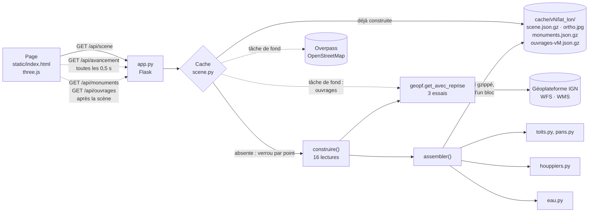

# Contribuer à Vue 3D IGN

Ce guide s'adresse aux développeurs qui veulent comprendre le code et y
contribuer. Il ne suppose aucune connaissance préalable en géomatique : les
termes du métier (MNH, BD TOPO, WMS…) sont expliqués dans le
[glossaire](#glossaire) en fin de document. Pour ce que fait la vue du point de
vue d'un utilisateur, voir le [README](README.md).

Le projet tient en trois choses : un serveur Python qui fabrique une **scène**
autour d'un point à partir des données ouvertes de l'IGN, un cache disque qui la
garde pour toujours, et une page unique en three.js qui l'affiche. Pas de base
de données, pas de clé d'API, pas d'étape de build côté navigateur.

## Sommaire

- [Démarrer en cinq minutes](#démarrer-en-cinq-minutes)
- [Architecture](#architecture)
- [Les modules](#les-modules)
- [La page](#la-page)
- [Le format de la scène](#le-format-de-la-scène)
- [Les invariants : ce qu'il ne faut jamais défaire](#les-invariants--ce-quil-ne-faut-jamais-défaire)
- [La méthode : mesurer d'abord](#la-méthode--mesurer-dabord)
- [Recettes](#recettes)
- [Tests](#tests)
- [Outils de mesure](#outils-de-mesure)
- [Déboguer](#déboguer)
- [Conventions](#conventions)
- [Pistes ouvertes](#pistes-ouvertes)
- [Glossaire](#glossaire)

## Démarrer en cinq minutes

Il faut **Python 3.12**, la version de l'image Docker. Pas 3.14 : avec les mêmes
versions de numpy et de shapely, la segmentation des arbres y rend zéro
houppier sans lever la moindre erreur (2 160 en 3.12 sur Gordes, mêmes
données). Comme le cache ne périme jamais, une scène construite ainsi resterait
fausse.

```bash
python3.12 -m venv .venv && . .venv/bin/activate
pip install -r requirements.txt pytest
pytest                                    # moins de 2 s, jamais de réseau
VUE3D_CACHE=./cache flask --app vue3d.app run --port 8080
```

Ouvrez ensuite <http://localhost:8080/?lat=43.9116&lon=5.2003> (Gordes). La
première ouverture d'un lieu construit sa scène en 20 à 40 secondes, et la page
affiche l'étape en cours ; les suivantes sont instantanées.

Pour vérifier la page dans un vrai navigateur (voir [Tests](#tests)) :

```bash
npm install puppeteer-core                # ignoré par git
node outils/essai-navigateur.mjs "http://localhost:8080/?lat=43.9116&lon=5.2003" capture.png
```

Le script cherche Chrome à son emplacement macOS par défaut ; ailleurs,
indiquez l'exécutable par la variable `CHROME`.

En conteneur : `docker compose up -d --build`, sur le port 8080 (ou
`VUE3D_PORT`). Les scènes y sont gardées dans le volume `scenes`.

## Architecture



Le trajet d'une demande, dans l'ordre :

1. La page lit `?lat=…&lon=…` dans son URL et demande `/api/scene`.
2. `app.py` passe la demande au `Cache` de `scene.py`, qui arrondit le point à
   quatre décimales (une dizaine de mètres) : deux demandes voisines partagent
   la même scène. Si elle est déjà sur disque, elle est servie telle quelle.
3. Sinon, un verrou par point garantit qu'une seule construction a lieu, même
   si plusieurs visiteurs demandent le même lieu en même temps. `construire()`
   lit alors seize sources de l'IGN, l'une après l'autre, et annonce chaque
   étape pour la barre d'avancement de la page. Pendant ce temps, deux tâches
   de fond lisent les couches à part : Overpass pour les monuments OSM, quatre
   couches BD TOPO pour les ouvrages.
4. `assembler()` fait les deux calculs longs : les toitures (`toits.py`, et
   `pans.py` pour les toits que le résumé manque), puis les arbres
   (`houppiers.py`), une fois réservoirs et constructions ponctuelles retirés
   du sursol (`constructions.py`). La scène est compressée et écrite sur disque de façon
   atomique : l'orthophoto d'abord, la scène ensuite, chacune par un fichier
   temporaire renommé.
5. La page reçoit un seul JSON et construit tout de son côté : bâtiments et
   toits, relief et son anneau, végétation, eau, routes, lignes, soleil et
   ombres.
6. Elle demande ensuite `/api/monuments`. La couche OSM, calculée sur la
   réponse de la tâche de fond et les bâtiments de la scène, est mise en cache
   à côté d'elle ; à son arrivée, la page reconstruit les bâtiments. Si
   Overpass ne répond pas, la page réessaie toutes les 30 s, et la scène reste
   affichée sans ses monuments.
7. Elle demande de même `/api/ouvrages` : murs, ponts, voies ferrées et
   terrains de sport, calculés sur les quatre couches lues en tâche de fond,
   le relief de la scène (la hauteur d'un mur est l'altitude de son sommet
   moins le relief) et ses masses de sursol (celles qu'un ouvrage explique).

L'emprise d'une scène est un carré de ±0,0016° autour du point : environ
±178 m du nord au sud, et ±115 à 130 m d'est en ouest selon la latitude. Un
anneau de relief grossier s'étend au-delà, sur 2 km de côté.

## Les modules

| Module | Rôle | À savoir |
|---|---|---|
| `app.py` | Routes Flask | `creer_app(dossier_cache, construire)` : la construction est injectable, c'est ainsi que les tests évitent le réseau |
| `scene.py` | Construction et cache | `SCENE_VERSION` (format), `ETAPES_SCENE` (suivi), `SceneIncomplete`, `Cache` et son verrou par point ; les couches à part y passent par le même chemin (`_prelire`, `_obtenir_couche`) |
| `geopf.py` | GET avec reprise | 3 essais espacés de 3 s, sur **tout** échec, refus 4xx compris |
| `batiments.py` | Bâtiments découpés sur l'emprise | Le WFS les rend entiers ; coupés à 1,25 m du bord pour que la grille MNH les encadre, ils portent `coupe` |
| `couches.py` | Lecture des couches WFS | Le serveur renvoie parfois une erreur Java avec un code 200 : c'est le contenu qui tranche |
| `mnh.py` | Grille des hauteurs (MNH) et terrain | GetMap au format BIL float32 ; repli MNS − MNT hors LiDAR HD ; `fetch_sol_grid` pour le terrain sous les toits |
| `ortho.py` | Indice de verdure, mosaïque d'orthophoto | Grille ExG alignée cellule pour cellule sur le MNH |
| `toits.py` | Profil de chaque toit | Gouttière, faîtage, corps de toit, bâtiments sous les arbres ou à deux niveaux, choix entre toit résumé, pans et surface |
| `pans.py` | Toits en pans | Plans ajustés au MNH, volume fermé vérifié, refusé sinon |
| `houppiers.py` | Arbres, un par un | Bassins de la grille lissée descendus depuis les sommets ; profil radial de chaque arbre ; hors forêt, rien au-dessus de 40 m |
| `constructions.py` | Réservoirs et constructions ponctuelles | Hauteur BD TOPO, à défaut LiDAR ; rend aussi le masque qui les retire du sursol des houppiers, jamais embarqué |
| `relief.py` | Relief RGE ALTI et anneau | Quantifié au décimètre ; le service rend −99999 hors couverture ; `echantillonneur` le relit côté serveur comme la page |
| `eau.py` | Étendues et cours d'eau | Découpés sur l'emprise ; les axes « fictifs » des rivières larges sont écartés ; `masque_eau` retire l'eau du sursol des houppiers |
| `lignes.py` | Lignes à haute tension | Hauteur des pylônes BD TOPO, à défaut médiane par tension |
| `monuments.py` | Parties de monuments OSM | Seule source hors IGN, et la plus lente ; extrait embarqué pour les lieux d'exemple ; règle de remplacement aux deux tiers, enveloppes |
| `ouvrages.py` | Murs, ponts, voies ferrées, terrains de sport | Couche à part, versionnée par `OUVRAGES_VERSION` ; hauteur d'un mur ou d'un pont = altitude de ses sommets − relief de la scène |
| `vehicules.py` | Véhicules et piscines lus sur l'orthophoto | Couche à part et **optionnelle** (`VUE3D_VEHICULES`) : un réseau ONNX à boîtes orientées sur l'orthophoto à 0,2 m, une passe par objet, chacun à son échelle ; fichier de cache au nom du détecteur ; sans la variable, ni onnxruntime ni réseau ne sont chargés |
| `static/index.html` | La page entière | HTML, CSS et JavaScript dans un seul fichier, three.js r160 |

Chaque module commence par une docstring qui dit **pourquoi** il est fait
ainsi, mesures à l'appui. C'est la meilleure porte d'entrée : lisez-la avant le
code.

## La page

`vue3d/static/index.html` est un fichier statique d'environ 4 450 lignes, sans
framework ni build. three.js r160 est chargé depuis jsDelivr par un
`importmap`. Le fichier est découpé en sections repérées par des commentaires
`// --- Titre ---` ; les principales, dans l'ordre :

| Section | Contenu |
|---|---|
| Point visé, Projection locale | Lecture de l'URL ; `toLocal(lon, lat)`, projection équirectangulaire centrée sur le point, en mètres |
| Scène, Géométrie des bâtiments | Scène three.js et matériaux ; murs, toits résumés, corps de toit |
| Surface mesurée du toit | `geometriesSurface` et `geometriesPans`, les deux formes mesurées |
| Bâtiment visé, Chargement des bâtiments | La fiche du bâtiment ; l'arrivée de la scène |
| Relief, Anneau de relief | Maillage du terrain, fond cartographique drapé |
| Eau de surface, Routes, Lignes à haute tension | Les couches posées sur le relief |
| Réservoirs et constructions ponctuelles | Citernes extrudées, torchères, cheminées, antennes et mâts |
| Ouvrages | La couche `/api/ouvrages` : rubans et aplats drapés, murs et tabliers en volumes fermés (`prismeLeLong`, `dalle`) |
| Végétation | Rendu des houppiers mesurés |
| Ma position | Géolocalisation et recentrage |
| Interactions, Boutons, Soleil et ombres portées | Survol, clics, bascules, course du soleil |

Quelques fonctions reviennent partout ; cherchez `function nom(` pour les
trouver :

- `construire(features, toitsEnPente)` reconstruit tous les bâtiments. Les
  bascules l'appellent aussi, par exemple « Toits en pente » ou « Toits mesurés ».
- `rebaserBatiments()` pose les bâtiments sur le relief.
- `geometriesSurface` et `geometriesPans` fabriquent les deux formes de toit
  mesurées.
- `geometrieToitDecoupe` fabrique le toit résumé — deux pans, pyramide, corps
  de toit — découpé sur l'emprise, pignons compris ; `poserDessus` donne la
  photo aérienne à un toit plat.
- `cadrer()` place la caméra sur le point.

Deux conventions de repère à connaître avant de toucher à la géométrie. En
mètres locaux, x va vers l'est et y vers le nord. Dans la scène three.js, un
point `(x, y, hauteur)` devient `(x, hauteur, -y)` : le nord est −Z. Cette
transformation est une rotation, elle conserve donc le sens des triangles, et
un triangle orienté vers l'extérieur le reste.

Les bâtiments sont posés au point le plus bas du terrain sous leur contour
(`baseBatiment`), enfoncés de 0,5 m (`ENFONCEMENT`) pour ne jamais flotter ;
`rebaserBatiments()` refait ce placement quand le relief arrive ou que
l'exagération change.

## Le format de la scène

La scène est un JSON gzippé, de 100 à 500 Ko par lieu. Clés de premier
niveau :

| Clé | Contenu |
|---|---|
| `version` | `SCENE_VERSION` au moment de la construction |
| `bbox` | Emprise `[ouest, sud, est, nord]` en degrés |
| `batiments` | La couche BD TOPO (GeoJSON), découpée sur l'emprise : un bâtiment coupé est en 2D et porte `coupe` = `{part, largeur_m}` |
| `toits` | `{source, resolution_m, ortho, grille, toits: {cleabs: profil}}` |
| `routes` | Tronçons de route BD TOPO : rubans sur le relief, et point de vue Street View |
| `constructions` | `{reservoirs, ponctuelles}` : emprises découpées `{nature, nom, h, source, coupe, contour, trous}` et points `{lon, lat, nature, detail, nom, h, source, r}` ; `source` dit d'où vient la hauteur (`bdtopo`, ou celle de la grille MNH), `r` est le rayon mesuré au LiDAR ou `null` |
| `houppiers`, `masses` | Arbres segmentés, et masses de sursol indéterminées |
| `vegetation` | Métadonnées : source, couverture, seuils |
| `relief`, `anneau` | Grilles RGE ALTI quantifiées ; `null` hors couverture |
| `eau`, `lignes` | Couches découpées sur l'emprise |

Les monuments OSM n'en font pas partie : `/api/monuments` les sert à part,
`{parties, remplaces}`, ou `null` quand l'emprise n'a aucune partie, le cas le
plus courant.

Les ouvrages non plus : `/api/ouvrages` rend `{version, murs, ponts, voies,
terrains, masses_expliquees}`, ou `null` sans ouvrage. Un mur est une `ligne`
de sommets `[lon, lat, z]`, z étant l'altitude de son sommet ; un pont, une
`ligne` et sa `largeur_m`, ou un `contour` et ses `trous` ; une voie, une
`ligne` en `[lon, lat]` au sol (`au_sol`), en `[lon, lat, z]` sur un ouvrage ;
un terrain, une `geometrie` GeoJSON. `masses_expliquees` liste les rangs, dans
`masses`, de celles que la page retire quand la couche est affichée. La couche
a sa propre version, `OUVRAGES_VERSION`, inscrite dans le nom de son fichier :
la changer ne reconstruit aucune scène.

Le profil d'un toit (`toits.toits[cleabs]`) porte `gouttiere`, `faitage`,
`denivele`, `fiable`, `axe_deg`, éventuellement `corps` (un toit par corps pour
les maisons en ailes), `hauteur_inconnue` et `sous_couvert` pour les bâtiments
sous les arbres, `mode_bas` pour un toit lu sous un arbre qui le couvre en
partie, `deux_niveaux` quand ce niveau haut n'est pas un arbre mais le
bâtiment, `ecart_resume` (écart en mètres entre le toit résumé et le
LiDAR), et au plus l'une des deux formes mesurées :

- **`pans`** : `sommets` en triplets d'entiers (dixièmes de maille depuis la
  première cellule de la fenêtre, vers l'est puis vers le sud, et décimètres de
  hauteur), `triangles` orientés vers l'extérieur dont les `n_toit` premiers
  forment le toit, `n_pans`, `ecart_m`, et `i0`/`j0`, la fenêtre dans la
  grille `toits.grille`.
- **`surface`** : la grille des hauteurs sous l'emprise, en décimètres, codée
  par écarts entre cellules voisines (bien mieux compressés par gzip que les
  hauteurs elles-mêmes).

**Toute modification du format impose d'incrémenter `SCENE_VERSION`** dans
`scene.py`, avec une ligne de commentaire qui dit ce qui a changé, et une
entrée dans le [journal des changements](CHANGELOG.md). Le numéro
fait partie du chemin du cache (`cache/v13/…`) : l'incrémenter invalide toutes
les scènes d'un coup.

## Les invariants : ce qu'il ne faut jamais défaire

Chacune de ces règles répond à un incident réel. Le
[CLAUDE.md](CLAUDE.md) les rappelle aux assistants de code ; les voici avec
leur raison.

**Une scène est complète ou n'existe pas.** Le cache ne périme jamais : les
données sources ne changent qu'au rythme des campagnes de l'IGN. Une scène
construite pendant une panne resterait donc fausse pour toujours. Toute source
en échec lève `SceneIncomplete`, rien n'est écrit, le serveur répond 503 et la
demande suivante réessaie. Distinguez toujours deux cas :

- « la donnée n'existe pas ici » est un **fait** : `fetch_relief` rend `None`
  hors couverture, et la scène est publiée sans relief ;
- « on n'a pas pu la lire » est un **incident** : il lève une exception.

N'ajoutez jamais un `try/except` qui avale une erreur de source pour
« publier quand même ». La même logique explique que la construction soit
**déterministe** : pas de tirage au sort (RANSAC ou autre), car un résultat
aléatoire serait figé pour toujours dans le cache.

**Les refus de la Géoplateforme sont sporadiques.** Une requête rejetée en 400
a répondu 200 six fois de suite, rejouée à l'identique. Toute lecture passe
donc par `geopf.get_avec_reprise`, qui réessaie tout échec, refus compris.

**WMS 1.3.0 en EPSG:4326 : la BBOX s'écrit `lat,lon`.** Inversée, le service
répond 200 avec une dalle vide, sans erreur. Et une image en EPSG:4326 doit
avoir des côtés proportionnels à l'étendue **en mètres**, sinon elle sort
étirée.

**La grille MNH à 0,5 m est lue une fois**, puis passée aux toitures et aux
houppiers ; elle n'est jamais embarquée dans la scène (1,9 Mo d'entrée de
calcul).

**La géométrie d'un houppier ne doit jamais se retourner** : rayon croissant
avec la couronne, hauteur décroissante du sommet au bord, dessous qui remonte
vers le tronc, même lobage pour tous les anneaux. Un défaut ici passe inaperçu
à forte opacité et saute aux yeux à 30 %.

**Un toit en pans est fermé ou n'est pas publié.** `pans.py` vérifie le volume
réellement transmis, après arrondi : chaque arête doit être portée par
exactement deux triangles, parcourue en sens opposés. Sinon il rend `None` et
le toit garde sa surface mesurée.

**Le service tourne en un seul processus.** Le Dockerfile lance gunicorn avec
un worker et huit threads, pour que le verrou par point et l'état du suivi,
tous deux en mémoire, soient partagés par toutes les requêtes. Passer à
plusieurs processus demanderait de déplacer les deux, sur disque par exemple.

## La méthode : mesurer d'abord

C'est la règle qui a le plus façonné le code. **Aucun seuil ne se choisit au
jugé** : chaque constante des modules de calcul porte en commentaire la mesure
qui l'a fixée, sur des données réelles. Par exemple, dans `pans.py` :

```python
# Tolérances de croissance d'une région : angle entre la normale d'une cellule
# et celle du plan courant, écart de la cellule à ce plan. Mesuré sur 165 toits
# fiables : à 12° et 0,15 m (valeurs courantes de la littérature), 30 % de
# couverture seulement sur les toits de plus de 35° de Strasbourg — à maille
# fixe, le bruit de la normale croît avec la pente. À 25° et 0,40 m, couverture
# >= 80 % pour 91 % des toits de Gordes et 85 % de ceux de Strasbourg […]
PANS_ANGLE_DEG = 25.0
```

Un nouveau seuil, ou un seuil modifié, se justifie de la même façon. Mesurez
sur au moins deux lieux contrastés : Gordes (village perché, relief fort,
végétation dense) et Strasbourg (plaine, tissu médiéval dense, toits raides)
sont les deux références habituelles.

Trois autres habitudes complètent celle-ci :

- **La géométrie se vérifie en exécutant le code, pas en le relisant.** Extraire
  les fonctions de `index.html` et les exécuter sous Node avec un THREE minimal
  a trouvé des facettes retournées que la relecture avait ratées.
- **La page se vérifie dans un navigateur**, avec `outils/essai-navigateur.mjs` :
  les tests Python ne voient aucun chemin du rendu.
- **Données publiques uniquement dans le dépôt.** Exemples, tests et captures
  portent sur des lieux publics (monuments, centres de villages), jamais sur
  l'adresse d'un particulier.

## Recettes

### Ajouter une source de données

1. Écrivez la lecture dans le module concerné : `couches.lire_couche` pour une
   couche WFS, sinon une fonction qui passe par `geopf.get_avec_reprise`.
   Rendez `None` ou une collection vide quand la donnée n'existe pas ;
   laissez l'exception remonter quand la lecture échoue.
2. Dans `scene.construire()`, appelez-la par `lire("libellé", fonction, …)` :
   l'échec devient `SceneIncomplete`, et l'étape est annoncée à la page.
   **Incrémentez `ETAPES_SCENE`** ; un test vérifie que le compte tombe juste.
3. Traitez la donnée dans une fonction pure, testable sans réseau, appelée par
   `assembler()` ou par `construire()`.
4. Ajoutez la clé à la scène et incrémentez `SCENE_VERSION`.
5. Dessinez-la dans `index.html`, puis vérifiez la page dans un navigateur.
6. Créditez la source : tableau des sources du README, et crédits de la page si
   sa licence l'exige.

### Dans la scène, ou dans une couche à part ?

Une source dont dépend un calcul de la scène — le masque du sursol, une
hauteur lue dans la grille MNH, qui n'existe que pendant la construction — va
dans la scène : c'est le cas des réservoirs, dont les emprises sortent du
sursol avant la segmentation des houppiers. Une source qui ne fait que
s'ajouter au dessin peut être une couche à part, servie par sa propre route
après la scène, comme les ouvrages : la scène ne l'attend pas, n'échoue pas
avec elle, et n'est pas reconstruite quand son format change. Pour en ajouter
une :

1. Un module avec une lecture (`fetch_…`, qui laisse remonter l'échec) et une
   fonction pure (`…_pour_emprise`) qui reçoit la réponse brute et ce qu'elle
   lit de la scène.
2. Dans `scene.py`, un nom de fichier versionné, une exception
   « indisponible », et deux méthodes du `Cache` sur `_prelire` et
   `_obtenir_couche`, avec un bassin de fils à elle dans `_taches`.
3. Dans `app.py`, la route, le lecteur injectable de `creer_app`, la lecture
   anticipée à la demande de la scène, et le 503.
4. Dans la page, le chargement après la scène, avec reprise et indicateur
   (`etatCouche`), sur le modèle de `chargerOuvrages`.

Les couches de l'orthophoto (véhicules, piscines) suivent ce chemin avec
trois particularités. Elles sont optionnelles : leur lecteur vient de
`vehicules.lecteur()`, qui rend `None` sans `VUE3D_VEHICULES`, et les routes
répondent alors `{"mode": "aucun"}` plutôt qu'une erreur. Leur « lecture »
est un calcul — l'orthophoto à 0,2 m, puis la détection — lancé en tâche de
fond sur un seul fil pendant que la scène se construit. Et il y a un fichier
par résultat — les piscines, puis les véhicules de chaque détecteur — pour
que la page dessine chacun dès qu'il est prêt : c'est elle qui réunit les
détecteurs, dans l'ordre que `/api/sante` lui donne. Les poids des réseaux ne sont pas dans le dépôt et ne doivent pas y
entrer : ceux de YOLO sont sous AGPL-3.0, et les deux réseaux sont entraînés
sur DOTA (usage académique). `outils/exporter_vehicules.py` les convertit en
ONNX dans l'étage `export` du Dockerfile.

### Changer un seuil

Relancez l'outil de mesure concerné (voir [Outils de mesure](#outils-de-mesure))
avant et après, sur Gordes et Strasbourg au minimum. Écrivez les chiffres dans
le commentaire de la constante et dans le corps du commit. Si le seuil change
le contenu des scènes, incrémentez `SCENE_VERSION`.

### Toucher aux toits en pans

- Tests synthétiques dans `tests/test_pans.py` : toit à deux pans tourné,
  surélévation, plans qui se croisent, cour intérieure, toit sans plans,
  déterminisme.
- Mesure sur données réelles : `python outils/mesure_pans.py [lat lon …]`, qui
  compte les toits passés en pans, retombés sur la surface, et le poids
  transmis.
- Contrôle visuel : dans la page elle-même, bouton « Toits mesurés » allumé ;
  la fiche d'un bâtiment dit combien de pans il a reçus. La visionneuse
  d'`outils/prototype_brep.py` montre les volumes du prototype, pas ceux de
  `pans.py` : elle sert à comparer, pas à valider.

### Ajouter un lieu d'exemple

Ajoutez la ligne au tableau « Lieux à essayer » du README, puis relancez
`python outils/extraire_monuments_exemples.py`. L'outil relit les liens du
README et embarque la réponse Overpass de chaque lieu dans
`vue3d/donnees/monuments_exemples.json.gz` : la scène d'un exemple n'attend
jamais OpenStreetMap, dont les réponses vont de 0,6 s à plus de 100 s. Un
test échoue tant que l'extrait ne couvre pas tous les liens du README. Lancé
sans nouvel exemple, l'outil rafraîchit l'extrait et sa date.

### Modifier la page

Pas de build : rechargez la page. Pour une fonction géométrique, extrayez-la et
exécutez-la sous Node avant de regarder le rendu : `outils/verifier-geometrie.mjs`
le fait pour le toit découpé et les ouvrages, ajoutez-y la vôtre. Finissez toujours par
`outils/essai-navigateur.mjs`, qui échoue à la moindre erreur JavaScript ou
requête en échec.

## Tests

```bash
pytest               # toute la suite, à lancer avant de conclure
pytest tests/test_pans.py -q
```

La suite ne touche **jamais** le réseau. Les sources sont remplacées de trois
façons :

- **Construction injectée.** `creer_app(dossier, construire=faux,
  lire_monuments=faux, lire_ouvrages=faux)` et `Cache(dossier,
  lire_monuments=faux, lire_ouvrages=faux)` acceptent une fausse construction
  et de fausses lectures d'Overpass et des couches d'ouvrages. La signature de
  la construction est `(lat, lon, avancer=None)`, celle des lectures
  `(ouest, sud, est, nord)`. Une application de test qui sert `/api/scene`
  doit injecter les deux lectures : la demande de la scène les lance en tâche
  de fond. `lire_vehicules=faux` active les couches de l'orthophoto ; la
  doublure a la forme de `vehicules.Lecteur` — `mode`, `detecteurs`,
  `piscines(emprise)` et `vehicules(detecteur)`, qui rendent des boîtes en
  pixels. Aucun test ne charge de réseau : `test_vehicules.py` passe à
  `detecter` une doublure de session d'inférence.
- **Grilles synthétiques.** Les tests de toitures fabriquent des grilles MNH à
  partir d'une fonction de hauteur (voir `_grille` dans `test_pans.py` ou
  `_grille_surface` dans `test_toits.py`) : un toit à deux pans, une marche, un
  arbre qui surplombe…
- **`monkeypatch`.** `test_construire_annonce_chacune_de_ses_etapes` remplace
  toutes les sources de `scene.py` pour vérifier le déroulé de `construire()`.

Ce que les tests Python ne voient pas, c'est le rendu : pour tout changement
dans `index.html`, lancez l'essai navigateur.

## Outils de mesure

Le dossier `outils/` contient des scripts qui interrogent la Géoplateforme en
direct. Ils écrivent leurs sorties dans `cache/mesures/`, ignoré par git.

| Outil | Ce qu'il mesure |
|---|---|
| `essai-navigateur.mjs` | Charge un lieu dans Chrome, clique le bâtiment visé, change de saison, relève toute erreur |
| `verifier-geometrie.mjs` | Pas une mesure : exécute sous Node les fonctions géométriques de la page (toit découpé, murs, tabliers, véhicules) et vérifie orientation, fermeture et volumes ; demande `npm install three@0.160.0` |
| `mesure_pans.py` | Toits en pans sur des lieux réels, par le vrai chemin de la scène |
| `mesure_constructions.py` | Réservoirs, constructions ponctuelles et ouvrages sur des lieux réels : hauteurs, effet du masque sur les houppiers, masses expliquées |
| `mesure_vehicules.py` | Véhicules et piscines sur des lieux réels, par le vrai chemin de la couche : comptes selon le seuil, la tuile et son recouvrement, gabarits, accord entre les deux détecteurs, images annotées, planches de vignettes des piscines ; demande les réseaux exportés et `requirements-vehicules.txt` |
| `exporter_vehicules.py` | Pas une mesure : télécharge les poids de RTMDet-R ou de YOLO11-OBB et les convertit en ONNX ; tourne dans l'étage `export` du Dockerfile |
| `prototype_plans.py` | Couverture de la segmentation en plans selon les tolérances |
| `prototype_brep.py` | Étanchéité des volumes, avec export OBJ et visionneuse 3D |
| `mesure_redressement.py` | Part du terrain dans les défauts des surfaces de toit |
| `extraire_monuments_exemples.py` | Pas une mesure : fabrique l'extrait OSM embarqué des lieux d'exemple |

Les scripts de prototype figent en en-tête les résultats obtenus lors de leur
écriture : relancez-les pour comparer, sans vous étonner d'écarts dus aux mises
à jour de l'IGN.

## Déboguer

- **Le cache** est dans `VUE3D_CACHE`, rangé en
  `v{SCENE_VERSION}/{lat}_{lon}/scene.json.gz` et `ortho.jpg`. Supprimez le
  dossier d'un lieu pour le reconstruire seul.
- **Lire une scène** (13 est la `SCENE_VERSION` actuelle) :
  `gunzip -c cache/v13/43.9116_5.2003/scene.json.gz | python -m json.tool | less`.
  Les couches à part sont à côté : `monuments.json.gz`, `ouvrages-v1.json.gz`.
  Supprimer l'un de ces fichiers refait la seule couche.
- **Suivre une construction** : `curl 'localhost:8080/api/avancement?lat=…&lon=…'`
  renvoie l'étape en cours. `VUE3D_LOG=DEBUG` rend les journaux du serveur plus
  bavards.
- **Un 503** signifie qu'une source n'a pas répondu malgré les reprises : rien
  n'a été mis en cache, il suffit de réessayer.

Pièges déjà rencontrés, à reconnaître vite :

| Symptôme | Cause |
|---|---|
| Une grille WMS revient vide, sans erreur | BBOX en `lon,lat` au lieu de `lat,lon` |
| Zéro arbre, sans erreur | Python 3.14 au lieu de 3.12 |
| Une orthophoto étirée | Image EPSG:4326 non proportionnelle à l'étendue en mètres |
| Une réponse WFS en 200 qui n'est pas du GeoJSON | Erreur Java du serveur (« Unable to obtain connection ») : c'est le contenu qui tranche, `lire_couche` le vérifie |
| Une scène construite pendant une panne | Un `try/except` avale une erreur de source quelque part |

## Conventions

- **Tout en français** : identifiants, commentaires, messages de commit,
  documentation.
- **Les commentaires disent pourquoi, mesure à l'appui**, jamais ce que fait
  la ligne suivante.
- **Messages de commit** au format `type(portée): résumé`, avec un corps qui
  explique le pourquoi et donne les mesures. Types en usage : `feat`, `fix`,
  `docs`, `chore` ; portées : `toits`, `page`, `app`, `scene`, `outils`… Pas de
  trailer `Co-Authored-By`.
- **Journal des changements** : tout changement de `SCENE_VERSION`, et tout
  changement que voit l'utilisateur, s'inscrit dans `CHANGELOG.md`, sous la
  version de scène en cours.
- **Avant de conclure** : toute la suite `pytest`, et l'essai navigateur si la
  page a changé.

## Pistes ouvertes

Des chantiers mesurés, prêts à être repris :

- **Toits en pans à Strasbourg.** 55 % des toits concernés y passent en pans,
  contre 87 % à Gordes. Parmi les refus, douze prolongent un plan plus de 2 m
  au-dessus des cellules mesurées : ils méritent une inspection visuelle avant
  de toucher au seuil.
- **Volumes en pans non fermés.** Cinq toits sont refusés parce que leur volume
  ne se ferme pas, avant ou après l'arrondi : quatre à Strasbourg, un à Gordes.
  La cause reste à diagnostiquer.
- **Temps de construction.** Mesuré à Rocamadour par le suivi d'avancement :
  35 s en tout, dont 12 s pour les houppiers, 8 s pour les toitures et 4 s pour
  les monuments OSM. Les houppiers sont la première piste.
- **Monuments OSM hors des lieux d'exemple.** Ailleurs, Overpass reste
  interrogé en direct. La scène ne l'attend plus et n'échoue plus avec lui,
  mais un monument peut apparaître avec retard. Un extrait France entier
  (134 446 `building:part` au 27 septembre 2026, 10 à 20 Mo compressé),
  publié en fichier de release plutôt que dans l'historique git, supprimerait
  cette attente.
- **Ponts.** La BD TOPO ne décrit que le tablier : le Pont du Gard est un
  ruban à 48 m du Gardon, sans arches. Les routes et voies qu'un pont porte
  ont elles aussi des sommets en 3D et pourraient être dessinées à leur
  altitude plutôt qu'écartées ; les monuments OSM (`bridge:structure`,
  `building:part`) sont une autre piste pour les ouvrages d'art remarquables.
- **Constructions non dessinées.** Éoliennes (300 lues, hauteur renseignée 45
  fois, sans dire si elle compte les pales), croix et calvaires, murs de
  soutènement (une marche du relief, que le RGE ALTI lisse). Les réservoirs
  sont des cylindres à toit plat : sphères de gaz et toits flottants ne sont
  pas distingués, alors que le MNH les montre là où il les voit.
- **Tuyauterie des sites industriels.** Une fois les citernes retirées du
  sursol, il reste 2 660 houppiers et masses sur quatre parcs de stockage,
  pour l'essentiel des portiques et des tuyaux ; la couche `canalisation` de
  la BD TOPO (327 tronçons autour de douze lieux) n'en donne que l'axe.
- **Arbres des falaises.** En forêt, où le sursol n'est pas plafonné, le MNH
  compte la hauteur d'un arbre accroché à une paroi depuis le pied de
  celle-ci : 7 houppiers de 42 à 60 m à Rocamadour, sur des chênes du causse.
  Un plafond par essence, ou la pente du terrain sous le houppier, restent à
  mesurer. Hors forêt, les cellules juste sous le plafond laissent des
  houppiers de 35 à 40 m au pied des tours (10 à Notre-Dame).
- **Bâtiments sous les arbres.** La règle est sévère dans les tissus denses et
  arborés, où l'orthophoto décale les feuillages sur les emprises voisines.
- **Couverture LiDAR HD.** Environ 77 % des bâtiments tirés au hasard sont
  couverts ; ailleurs, le repli photogrammétrique lisse faîtages et cimes.

## Glossaire

| Terme | Sens |
|---|---|
| **Géoplateforme** | L'infrastructure de l'IGN qui sert ses données sans clé d'API (`data.geopf.fr`) |
| **WFS** | Service qui rend des objets vectoriels (polygones, lignes), ici en GeoJSON |
| **WMS** | Service qui rend une image, ou une grille de valeurs, sur une emprise donnée |
| **WMTS** | Le même en tuiles précalculées, pour les fonds de carte |
| **BIL** | Format de grille brute : des float32 ligne par ligne depuis le nord-ouest |
| **EPSG:4326** | Coordonnées en degrés de latitude et de longitude (WGS 84) |
| **BD TOPO** | Base vectorielle de l'IGN : bâtiments, routes, eau, lignes électriques… |
| **`cleabs`** | Identifiant d'un objet BD TOPO ; il sert de clé aux profils de toit |
| **BD Forêt** | Base des formations végétales et de leur essence dominante |
| **LiDAR HD** | Programme de relevé laser aérien de l'IGN, en cours de déploiement |
| **MNT** | Modèle numérique de terrain : l'altitude du sol nu |
| **MNS** | Modèle numérique de surface : l'altitude de ce qu'on voit d'avion, toits et arbres compris |
| **MNH** | Modèle numérique de hauteur, MNS − MNT : la hauteur de ce qui dépasse du sol |
| **RGE ALTI** | Le MNT national de l'IGN, qui donne le relief de la scène |
| **Orthophoto** | Photo aérienne redressée pour se superposer à une carte |
| **ExG** | Indice de verdure 2G − R − B, calculé sur l'orthophoto pour reconnaître le feuillage |
| **Emprise** | Zone couverte ; pour un bâtiment, son contour au sol |
| **Gouttière, faîtage** | Le bas et le haut d'un toit |
| **Houppier** | La couronne d'un arbre : sa partie feuillue au-dessus du tronc |
| **LoD2** | Niveau de détail d'une maquette urbaine où les toits ont leur vraie forme |
| **B-Rep** | Représentation d'un solide par ses faces ; « étanche » quand il est fermé |
| **Overpass**, **`building:part`** | L'API de requêtes d'OpenStreetMap, et les parties de bâtiments modélisées en 3D |
