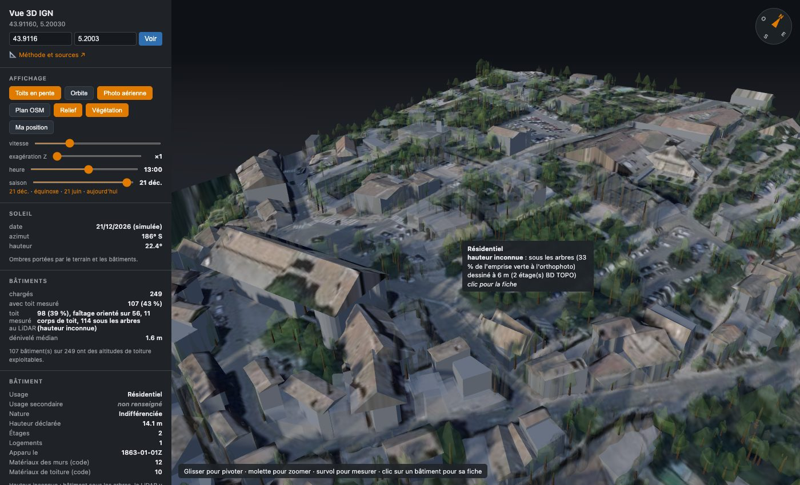

# Vue 3D IGN

Une vue 3D de n'importe quel lieu de France métropolitaine, reconstruite à partir
des **données ouvertes de l'IGN** : on donne une latitude et une longitude, on
obtient les bâtiments avec leurs vrais toits, les arbres un par un, le relief et
la photo aérienne, sous un soleil qui suit sa vraie course.



*Gordes (Vaucluse) au 21 décembre à 13 h : 249 bâtiments, 2 160 houppiers,
84 m de relief. Orthophoto et données © IGN.*

Aucune clé d'API, aucune base de données : un conteneur Docker, un cache disque,
et les services publics de la [Géoplateforme](https://geoservices.ign.fr/).

## Démarrer

```bash
docker compose up -d
```

Puis ouvrir <http://localhost:8080/?lat=43.9116&lon=5.2003>, ou saisir un point
dans le panneau. Sans paramètre, la page s'ouvre sur la cour du château de
Versailles.

La **première** ouverture d'un lieu construit sa scène : 20 à 40 secondes, le
temps de télécharger une grille de hauteurs à 0,5 m et d'y segmenter les arbres.
Les ouvertures suivantes sont instantanées, la scène étant gardée sur disque dans
le volume `scenes`. Pour changer de port : `VUE3D_PORT=9000 docker compose up -d`.

Sans Docker, **avec Python 3.12**, celui de l'image Docker :

```bash
python3.12 -m venv .venv && . .venv/bin/activate
pip install -r requirements.txt
VUE3D_CACHE=./cache flask --app vue3d.app run --port 8080
```

Pas Python 3.14 : avec les mêmes versions de numpy et shapely, la segmentation
des arbres y rend 0 houppier sans la moindre erreur (2 160 en 3.12 sur Gordes,
mêmes données). Et comme le cache ne périme pas, une scène construite ainsi
resterait fausse.

## Lieux à essayer

Des lieux publics qui montrent chacun un aspect de la vue. Les chiffres sont ceux
des scènes construites en septembre 2026 ; ils suivent les mises à jour de l'IGN.

| Lieu | Ce qu'il montre |
|---|---|
| [Château de Versailles, cour](http://localhost:8080/?lat=48.8049&lon=2.1204) | Le lieu par défaut : un grand toit découpé en plusieurs corps, 146 arbres des jardins |
| [Gordes, village](http://localhost:8080/?lat=43.9116&lon=5.2003) | Village perché : 84 m de relief sur l'emprise, 242 m dans l'anneau, 2 160 houppiers |
| [Rocamadour, basilique](http://localhost:8080/?lat=44.7994&lon=1.6177) | Sanctuaire accroché à la falaise : 130 m de dénivelé sous les bâtiments |
| [Chamonix, église](http://localhost:8080/?lat=45.9232&lon=6.8733) | Fond de vallée : l'anneau monte de 624 m sur les pentes alentour |
| [Abbaye du Mont-Saint-Michel](http://localhost:8080/?lat=48.6360&lon=-1.5114) | Le rocher et sa baie. Hors LiDAR HD : l'abbaye est reprise au modèle 3D d'OpenStreetMap, flèche comprise |
| [Saint-Malo, cathédrale](http://localhost:8080/?lat=48.6495&lon=-2.0256) | Ville close dense (253 toits mesurés) ; la mer laisse un tiers de l'anneau vide |
| [Cité de Carcassonne](http://localhost:8080/?lat=43.2065&lon=2.3640) | Remparts et 292 bâtiments serrés sur 44 m de relief |
| [Notre-Dame de Paris](http://localhost:8080/?lat=48.8530&lon=2.3499) | L'île de la Cité, et 1 172 arbres des quais et des squares |
| [Cathédrale de Strasbourg](http://localhost:8080/?lat=48.5819&lon=7.7510) | Tissu médiéval en plaine : toits LiDAR à plusieurs corps, et la cathédrale reprise à OpenStreetMap |
| [Château de Chambord](http://localhost:8080/?lat=47.6162&lon=1.5171) | Le château isolé dans son domaine boisé : 477 houppiers |

Chaque premier chargement construit la scène, en 20 à 40 secondes.

## Ce que montre la vue

- **Les bâtiments et leurs toits.** Les murs montent à la gouttière et le toit
  rejoint le faîtage, **mesurés au LiDAR HD** quand la mesure est fiable, sinon
  déclarés par la BD TOPO. Un bâtiment en ailes reçoit un toit par corps, chacun
  sur son propre faîtage. Le bouton **Toits mesurés** remplace ce toit résumé
  là où il manque le LiDAR de plus de 0,7 m — moitié surélevée, faîtage
  décentré, îlot autour d'une cour — par des **pans** : quelques plans ajustés
  au LiDAR, faîtages nets, fermés par leurs murs. Un toit qui n'est pas fait de
  plans garde la surface même du LiDAR, plus granuleuse. Le bouton est éteint
  au départ.
- **Le bâtiment visé**, qui contient le point ou, à défaut, le plus proche à
  moins de 25 m, est en orange et sa fiche s'ouvre d'elle-même : BD TOPO,
  mesures LiDAR, distance au point, forme du toit dessiné. Un clic sur un autre
  bâtiment ouvre la sienne, avec un lien Street View orienté depuis la rue.
- **Les monuments en 3D OpenStreetMap** (`building:part`), là où la vue ne
  sait pas faire mieux : sans LiDAR HD, l'abbaye du Mont-Saint-Michel n'était
  qu'un prisme coiffé d'un toit inventé ; ses 37 parties OSM — flèche à 79 m,
  tour-lanterne, La Merveille — la remplacent. Là où le LiDAR mesure, il fait
  foi : seuls les bâtiments dont il ne sait rien (sous les arbres, profil
  rejeté) sont repris à OSM — la cathédrale de Strasbourg, que la règle
  « sous les arbres » écrasait à 3 m, y gagne son modèle complet. Le bouton
  **Monuments OSM** débraye la couche ; il n'apparaît que si la scène a des
  parties.
- **L'eau** : lacs, retenues, bassins et rivières larges en nappes, ruisseaux en
  rubans de la largeur de leur classe, posés sur le relief.
- **Les routes**, en rubans sur le relief, à leur largeur de chaussée.
- **Les lignes à haute tension** de RTE (63 à 400 kV), jusqu'à un kilomètre
  alentour : pylônes à leur hauteur, câbles tendus entre eux. Le réseau de
  distribution d'Enedis n'est pas dans la BD TOPO.
- **Les arbres, un par un.** La végétation est segmentée houppier par houppier
  sur le modèle de hauteur à 0,5 m. Chaque arbre garde sa hauteur, son emprise,
  son allongement et son profil mesurés : un pin parasol a un sommet plat, un
  cyprès une pointe.
- **Le relief**, drapé de la photo aérienne ou du Plan IGN, avec une
  exagération réglable. Autour de la scène, un anneau de relief plus grossier
  s'étend sur 2 km de côté et se perd dans la brume : les coteaux voisins
  cadrent le lieu et portent leur ombre quand le soleil rase.
- **Le soleil**, à l'heure et au jour choisis : un curseur pour l'heure, un
  autre pour la saison, avec des crans aux solstices et à l'équinoxe. Les ombres
  portées suivent. Le panneau chiffre le **masque solaire au sud**, l'élévation
  du plus haut obstacle vu depuis la toiture du bâtiment visé.

## Les sources

Toutes servies sans clé par la Géoplateforme de l'IGN, sous
[Licence Ouverte Etalab 2.0](https://www.etalab.gouv.fr/licence-ouverte-open-licence/)
— sauf la dernière, la seule hors IGN du projet.

| Donnée | Service | Ce qu'elle apporte |
|---|---|---|
| BD TOPO, bâtiments | WFS `BDTOPO_V3:batiment` | Emprises, usage, hauteurs et altitudes de toit déclarées |
| BD TOPO, végétation | WFS `BDTOPO_V3:zone_de_vegetation` | Où est la végétation (haie, bois, forêt…), jamais sa hauteur |
| BD Forêt v2 | WFS `LANDCOVER.FORESTINVENTORY.V2:formation_vegetale` | Essence dominante d'un massif, pour la couleur des arbres |
| BD TOPO, routes | WFS `BDTOPO_V3:troncon_de_route` | Les routes, et le point de vue Street View posé sur la rue |
| BD TOPO, réseau électrique | WFS `ligne_electrique`, `pylone` | Lignes à haute tension et hauteur des pylônes |
| LiDAR HD, MNH | WMS, grille BIL à 0,5 m | Hauteur de tout ce qui dépasse du sol : toits et arbres |
| MNS − MNT | WMS, repli photogrammétrique | Le même, hors couverture LiDAR HD, en moins net |
| RGE ALTI | WMS, grille BIL | Le relief du terrain, et l'anneau alentour |
| Orthophoto | WMS, WMTS | La photo aérienne, et l'indice de verdure qui reconnaît le feuillage |
| Plan IGN v2 | WMTS `GEOGRAPHICALGRIDSYSTEMS.PLANIGNV2` | Le fond plan, au choix de la photo |
| BD TOPO, hydrographie | WFS `surface_hydrographique`, `troncon_hydrographique` | Étendues et cours d'eau |
| OpenStreetMap, `building:part` | API Overpass, © contributeurs OSM, [ODbL](https://www.openstreetmap.org/copyright) | Les monuments en vraie 3D, là où le LiDAR manque |

three.js est chargé depuis jsDelivr. Le lien Street View ouvre Google Maps.

## La méthode, en bref

Chaque règle a été fixée après une mesure sur des données réelles. Les
principales :

- **Toits mesurés.** Le toit résumé s'écarte du LiDAR de 0,60 m en médiane à
  Gordes, de 0,98 m à Strasbourg ; la surface n'est proposée qu'au-delà de
  0,7 m, seuil fixé sur des toits examinés un à un (40 % des toits fiables de
  Gordes, 70 % de ceux de Strasbourg). Les cellules à moins de 0,75 m du
  contour mêlent toit et sol et reprennent leurs voisines. Sur la pente, la
  surface est redressée par le terrain du LiDAR lui-même, non par le RGE ALTI,
  dont les restanques ondulaient le toit. Elle colle au LiDAR à 4 à 8 cm près.
- **Toits en pans.** Cette surface est d'abord découpée en plans, par
  croissance de régions déterministe (la scène est cachée pour toujours : pas
  de tirage au sort). À 12° et 0,15 m, les tolérances courantes, un toit de
  Strasbourg sur trois seulement se découpait : à maille fixe, le bruit de la
  normale croît avec la pente. À 25° et 0,40 m, 87 % des toits proposés à
  Gordes et 55 % à Strasbourg passent en pans, à 8-12 cm du LiDAR ; le reste
  garde la surface. Chaque volume est vérifié fermé — toute arête portée par
  deux triangles, en sens opposés — et refusé sinon, jamais approché. Mesure :
  `python outils/mesure_pans.py [lat lon]`.
- **Toitures.** Gouttière au 15e centile et faîtage au 85e des hauteurs LiDAR
  de l'emprise érodée, plutôt que le minimum et le maximum : un arbre qui
  surplombe gonfle le maximum (16 m lus sur une maison de 4 m). La mesure est
  rejetée si le haut du profil n'est pas un toit, et une toiture à moitié sous
  un arbre est relue dans le mode bas de son profil. Les altitudes de toit BD
  TOPO manquent sur près d'un tiers des bâtiments d'un site mesuré, et sont
  bruitées dans les deux sens ailleurs.
- **Bâtiments sous les arbres.** Le LiDAR y lit la canopée : une annexe de
  12 m² sous les feuillages lisait un toit plat à 12 m qui passait tous les tests
  de forme. L'orthophoto tranche : au-delà d'un tiers de l'emprise verte, la
  hauteur est déclarée inconnue, et le bâtiment est dessiné pâle, sans toit.
- **Végétation.** Une cellule du modèle de hauteur est de la végétation si elle
  tombe dans une zone BD TOPO, ou si l'orthophoto y est verte (indice
  ExG = 2G − R − B, seuil 4 : 93 % de la végétation reconnue pour 2 % de toits
  pris pour du vert). Les houppiers sont les bassins de la grille lissée,
  descendus depuis leurs sommets. Leur emprise au sol est une ellipse d'aire et
  d'allongement mesurés, inscrite à 80 % dans son segment pour laisser voir les
  trouées.
- **Port des arbres.** L'essence BD Forêt ne décrit qu'un massif : quand elle
  dit « mixte », c'est le profil mesuré de l'arbre qui choisit son port — un
  sommet qui se maintient loin du centre est un pin, une cime effilée un
  conifère, un dôme un feuillu.
- **Bâtiments sur la pente.** Posé au point le plus bas du terrain sous son
  contour, un bâtiment ne flotte jamais côté aval ; mais son toit est relevé
  au-dessus du terrain médian de l'emprise, d'où se comptent ses hauteurs.
  Sans cela, 15 toits sur 104 passaient sous le rocher au Mont-Saint-Michel,
  13 sur 139 à Rocamadour ; relevés, 1 et 3.
- **Monuments OSM.** OSM et la BD TOPO ne découpent pas le bâti pareil : au
  Mont-Saint-Michel, l'union brute des parties ne couvre les emprises BD TOPO
  du complexe abbatial qu'à 29-100 %. La même union dilatée de 5 m couvre
  l'îlot à 86-100 % et le village à 55 % au plus : un bâtiment est remplacé
  au-dessus de deux tiers, seuil au milieu du trou. Une partie sans hauteur
  prend celle, mesurée, du bâtiment BD TOPO qui la contient. Une partie qui
  en recouvre d'autres, mesurées et plus basses — l'« Église abbatiale »
  porte les 78,5 m de la flèche sur tout le vaisseau —, est une enveloppe et
  repart sur ce même repli.
- **Une scène est complète ou n'existe pas.** Le cache ne périme pas, les
  données sources ne changeant qu'au rythme des campagnes IGN. Une scène
  construite pendant une panne resterait donc fausse pour toujours : si une
  seule source ne répond pas, rien n'est mis en cache et le serveur répond 503.
  Les lectures réessaient trois fois, refus compris, car le service renvoie des
  400 sporadiques sur des requêtes valides.

## Limites

- **France métropolitaine seulement.** Hors de cette emprise, le serveur refuse
  le point.
- **Couverture LiDAR HD en cours.** Environ 77 % des bâtiments tirés au hasard
  sont couverts ; ailleurs, le repli photogrammétrique lisse les cimes et les
  faîtages, et le panneau le signale.
- **Une scène couvre environ 356 m de côté** autour du point. Au-delà, l'anneau
  ne porte que le relief (maille de 16 m) et le fond en basse résolution, sans
  bâtiment ni arbre. En bord de mer ou de frontière, ses parties hors
  couverture RGE ALTI restent vides.
- **Les monuments OSM valent ce que les contributeurs y ont mis** : des
  parties sans hauteur (La Merveille, Le Châtelet) reçoivent celle de la BD
  TOPO, et l'infobulle le dit. La couche vient d'Overpass, le seul service
  hors IGN du projet.
- **La règle « sous les arbres » est sévère** dans les tissus denses et arborés,
  où l'orthophoto, qui n'est pas une vraie orthophoto, décale les feuillages
  sur les emprises voisines.

## API

| Route | Réponse |
|---|---|
| `GET /?lat=…&lon=…` | La page |
| `GET /api/scene?lat=…&lon=…` | La scène, en JSON gzippé |
| `GET /api/ortho?lat=…&lon=…` | L'orthophoto de la scène, en JPEG |
| `GET /api/sante` | `{"ok": true}` |

Codes d'erreur : 400 sans coordonnées valides, 422 hors de France métropolitaine,
503 si un service de l'IGN n'a pas répondu (rien n'est mis en cache, réessayer).

## Développer

```bash
python3.12 -m venv .venv && . .venv/bin/activate
pip install -r requirements.txt pytest
pytest
```

Les tests Python ne voient pas le rendu. Pour la page elle-même, un essai dans un
vrai navigateur charge un lieu, clique le bâtiment visé, change de saison et
échoue à la moindre erreur JavaScript :

```bash
npm install puppeteer-core
node outils/essai-navigateur.mjs "http://localhost:8080/?lat=43.9116&lon=5.2003" capture.png
```

## Licence

Code sous licence [MIT](LICENSE). Les données affichées appartiennent à l'IGN et
sont diffusées sous Licence Ouverte Etalab 2.0 ; les parties de monuments
viennent d'OpenStreetMap (© contributeurs OSM, ODbL).
